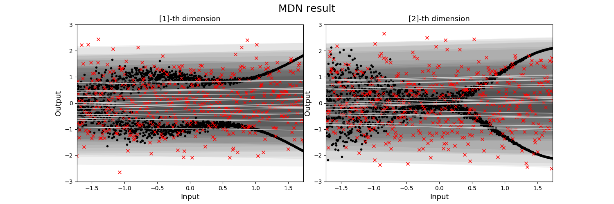

## Mixture_Density_Network

MDN을 이용하여, explainable variance와 unexplainable variance을 구하여, Uncertainty를 구합니다.

최성준 박사님의 tensorflow로 구현된 코드를 keras로 구현하였습니다.

## MDN

위의 이미지와 같이 multimodal한 data를 fitting 시킬 수 있다.

특히 , MDN은 single output을 predict하는 것이 아니라, output의 probabiltiy distribution을 predict한다.

## result

### fitting result

- 0 epoch

### explainable/ unexplainable variance

## reference

- github : https://github.com/sjchoi86/density_network

