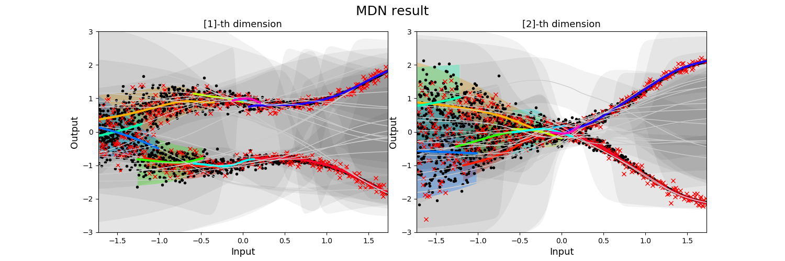
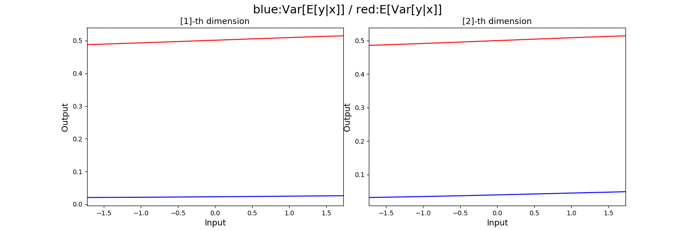
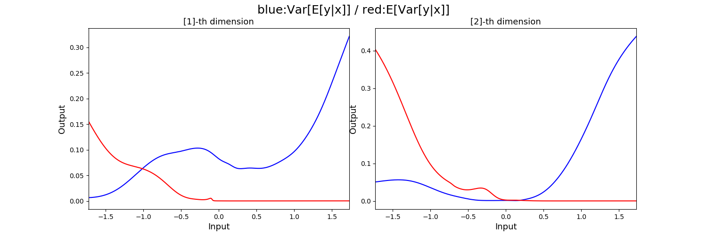

## Mixture_Density_Network

MDN을 이용하여, explainable variance와 unexplainable variance을 구하여, Uncertainty를 구합니다.

최성준 박사님의 tensorflow로 구현된 코드를 keras로 구현하였습니다.

## MDN

위의 이미지와 같이 multimodal한 data를 fitting 시킬 수 있다.

특히 , MDN은 single output을 predict하는 것이 아니라, output의 probabiltiy distribution을 predict한다.

## Precautions

### unstable loss

학습시 상당히 불안정한 loss(nan)을 배출하는 모습을 보입니다.

이를 해결하기 위해서 'selu' activation을 사용하였습니다.

### underfitting issue

batch_normalization을 이용하여 개선하였습니다.

## result

### fitting result

- 0 epoch

- 16000 epoch

### explainable/ unexplainable variance

expainable variance란 training data를 더 수집하면 개선할 수 있는 uncertainty를 의미한다.

반면에 unexplainable variance는 data자체의 noise로 training data를 더 수집하여도 개선할 수 없다.

- 0 epoch

- 16000 epoch

## reference

- github : https://github.com/sjchoi86/density_network

